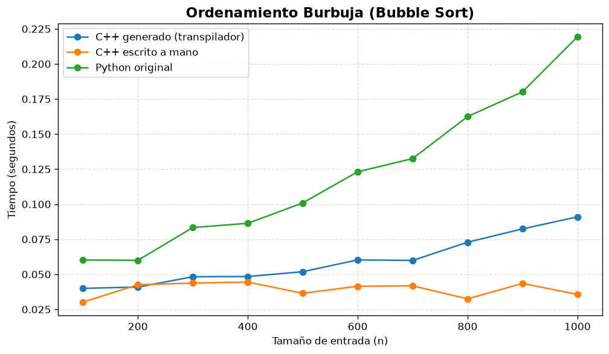
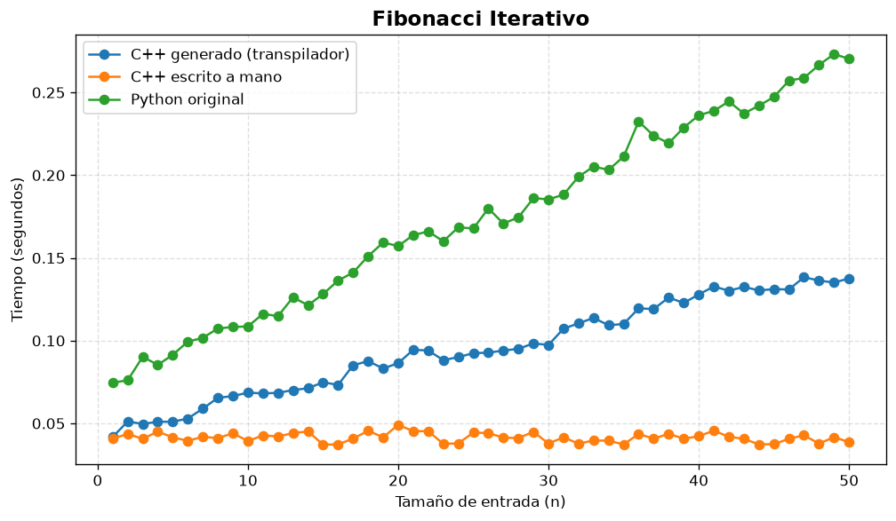
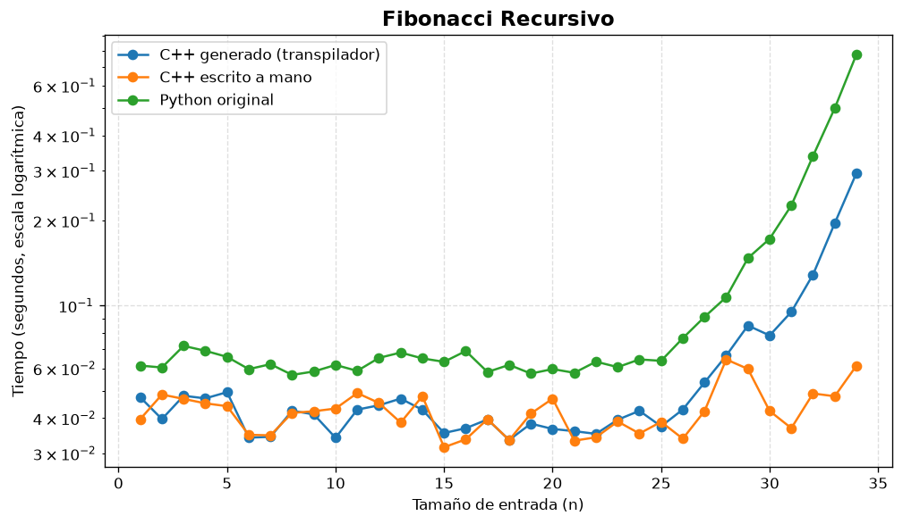

# Performance Analysis — Fangless Python Transpiler

*Generated on 2026-07-02 05:23 UTC from `benchmark_results.csv`.*

## 1. Methodology

Three implementations of each algorithm were compared:

| Label | Description |
| --- | --- |
| Original Python | Fangless source executed by CPython |
| Generated C++ | Same source transpiled to C++ and compiled with `g++ -std=c++17 -O2` |
| Hand-written C++ | Native C++ reference in `benchmarks/handwritten_cpp/` compiled with `-O2` |

- **Timing**: wall-clock (`time.perf_counter`) including process startup.
- **Best-of-N**: minimum of multiple runs per data point (see `--samples` in the harness).
- **Correctness**: each program prints a checksum; mismatches are flagged in the CSV.
- **Charts**: see `results/fib_recursive.png`, `results/fib_iterative.png`, `results/bubble_sort.png` (generated by `plot_results.py`).

## 2. Algorithms and Input Sizes

| Algorithm | Input sizes | Notes |
| --- | --- | --- |
| Recursive Fibonacci | n = 1..34 | Assignment asks for 1..50; 35..50 omitted due to exponential cost |
| Iterative Fibonacci | n = 1..50 | Each run repeats the computation 100,000× |
| Bubble sort | n = 100, 200, …, 1000 (10 sizes) | Reverse-sorted list (worst case) |

## 3. Results

### 3.1 Bubble Sort

- Sizes tested: **10**
- Checksum mismatches: **0**
- Timed-out runs: **0**

| n | python (s) | generated_cpp (s) | handwritten_cpp (s) | gen vs py | native vs py |
| --- | --- | --- | --- | --- | --- |
| 100 | 0.0602 | 0.0400 | 0.0302 | 1.51x | 2.00x |
| 200 | 0.0600 | 0.0409 | 0.0426 | 1.47x | 1.41x |
| 300 | 0.0834 | 0.0483 | 0.0437 | 1.73x | 1.91x |
| 400 | 0.0864 | 0.0484 | 0.0445 | 1.78x | 1.94x |
| 500 | 0.1009 | 0.0519 | 0.0365 | 1.95x | 2.77x |
| 600 | 0.1231 | 0.0603 | 0.0415 | 2.04x | 2.96x |
| 700 | 0.1325 | 0.0599 | 0.0418 | 2.21x | 3.17x |
| 800 | 0.1625 | 0.0729 | 0.0325 | 2.23x | 5.00x |
| 900 | 0.1801 | 0.0824 | 0.0435 | 2.19x | 4.14x |
| 1000 | 0.2194 | 0.0910 | 0.0357 | 2.41x | 6.15x |



#### Analysis

Bubble sort stresses nested loops, comparisons, and list indexing/mutation — all routed through the dynamic runtime in generated code. Average speedup generated C++ vs Python ≈ 2.03x; hand-written vs generated ≈ 1.52x. Native C++ uses a `std::vector<int>` with direct memory access, while generated code uses `PyValue` lists with runtime type checks on every `py_get_item` / `py_set_item` call.

### 3.2 Iterative Fibonacci

- Sizes tested: **50**
- Checksum mismatches: **0**
- Timed-out runs: **0**

*Showing representative rows (full data in `benchmark_results.csv`).*

| n | python (s) | generated_cpp (s) | handwritten_cpp (s) | gen vs py | native vs py |
| --- | --- | --- | --- | --- | --- |
| 1 | 0.0746 | 0.0418 | 0.0408 | 1.78x | 1.83x |
| 10 | 0.1086 | 0.0686 | 0.0393 | 1.58x | 2.76x |
| 20 | 0.1572 | 0.0864 | 0.0492 | 1.82x | 3.20x |
| 30 | 0.1854 | 0.0974 | 0.0379 | 1.90x | 4.90x |
| 34 | 0.2032 | 0.1093 | 0.0396 | 1.86x | 5.13x |
| 40 | 0.2362 | 0.1279 | 0.0423 | 1.85x | 5.59x |
| 50 | 0.2703 | 0.1376 | 0.0387 | 1.96x | 6.98x |



#### Analysis

The iterative benchmark repeats the computation 100,000 times per input to amplify measurable differences. Average speedups across n = 1..50: generated C++ vs Python ≈ 1.83x, hand-written C++ vs Python ≈ 4.19x. Generated code is often competitive with or faster than CPython for larger *n* because the hot loop runs as compiled machine code, but each arithmetic step still goes through the `PyValue` runtime (variant dispatch and heap boxing). Hand-written C++ avoids that entirely and represents the performance ceiling.

### 3.3 Recursive Fibonacci

- Sizes tested: **34**
- Checksum mismatches: **0**
- Timed-out runs: **0**

*Showing representative rows (full data in `benchmark_results.csv`).*

| n | python (s) | generated_cpp (s) | handwritten_cpp (s) | gen vs py | native vs py |
| --- | --- | --- | --- | --- | --- |
| 1 | 0.0614 | 0.0474 | 0.0397 | 1.29x | 1.55x |
| 10 | 0.0617 | 0.0341 | 0.0432 | 1.81x | 1.43x |
| 20 | 0.0596 | 0.0366 | 0.0469 | 1.63x | 1.27x |
| 30 | 0.1725 | 0.0784 | 0.0424 | 2.20x | 4.07x |
| 34 | 0.7751 | 0.2948 | 0.0613 | 2.63x | 12.64x |



#### Analysis

Recursive Fibonacci grows exponentially. Python and generated C++ pay function-call and dynamic-dispatch overhead on every recursive step, so runtimes explode as *n* increases. Hand-written C++ uses native `int64_t` arithmetic and direct calls, staying faster but still exponential. Sizes 35–50 are excluded because `fib(50)` alone requires roughly 40 billion calls and would take hours under naive recursion.

## 4. Overall Conclusions

1. **Correctness**: All three implementations produced matching checksums for every completed run, confirming that the transpiler preserves program semantics.
2. **Generated vs Python**: Transpiled C++ is faster on compute-heavy workloads (iterative Fibonacci, bubble sort) because the logic runs as native machine code with `-O2` optimizations, despite the `PyValue` runtime overhead.
3. **Generated vs hand-written C++**: The gap measures the cost of emulating Python dynamic typing — variant dispatch, runtime type checks, and boxed values on every operation.
4. **Recursive Fibonacci**: All versions degrade exponentially; this benchmark highlights call overhead rather than arithmetic throughput.
5. **Practical takeaway**: The transpiler delivers real speedups over interpreted Python for structured algorithms, while hand-written C++ shows the upper bound if static types were known at compile time.

## 5. How to Reproduce

```bash
pip install -r requirements.txt
python benchmarks/run_benchmarks.py --samples 5
python benchmarks/plot_results.py
python benchmarks/generate_report.py
```
